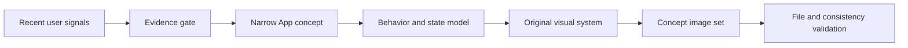

# Spark Skills

**Reusable AI workflows for turning sparks into concrete work.**

[English](README.md) · [简体中文](README.zh-CN.md)

Spark Skills is a growing collection of Codex skills built through daily product exploration, visual design practice, independent making, and AI tutorial creation.

Each skill turns a repeatable creative process into an executable workflow: clear triggers, evidence and decision criteria, practical steps, concrete deliverables, and validation when the result can be checked deterministically. The repository is maintained as a long-term creator project, with new skills added as the underlying workflows become useful and stable enough to reuse.

## What belongs here

- **Product and design workflows** that move from real user signals to a focused product concept.
- **Creator workflows** for research, ideation, production, review, and publishing preparation.
- **AI tutorial workflows** that make a technique reproducible instead of leaving it as a one-off demo.
- **Validation tools** for checking files, structure, consistency, and delivery requirements.
- **Focused references** that preserve the knowledge a skill needs without overloading its main instructions.

The goal is to make every skill useful beyond a single conversation. A good skill should help another Codex instance make better decisions and produce a result that can be reviewed directly.

## Available skills

| Skill | Purpose | Main deliverables | Status |
| --- | --- | --- | --- |
| [`daily-app-concept`](skills/daily-app-concept/) | Find a current mobile product need, narrow it into a solo-developer-friendly App concept, derive an original visual system from product behavior, and create a coherent concept image set. | Research notes, product definition, visual system, manifest, and 5–7 App concept images. | Available |

### `daily-app-concept`

This is the first workflow in Spark Skills. It grew out of a daily design and product-idea practice, where a visually attractive concept still had to answer four basic questions:

1. Is there credible evidence that the problem exists?
2. Can one person build and test a narrow solution?
3. Does the visual language explain the product's core behavior?
4. Are the final images readable, consistent, original, and complete?

The skill researches recent user feedback and comparable products, scores candidate directions, defines a focused MVP, studies relevant design methods, and maps product behavior into interface components and states. It then creates a set of actual concept images and validates the output package.



Read the full instructions in [`skills/daily-app-concept/SKILL.md`](skills/daily-app-concept/SKILL.md).

## Working principles

Spark Skills follows a few recurring principles:

- **Evidence before commitment.** Separate direct user feedback, market proof, creator claims, and inference.
- **Narrow the product.** Define one target user, one trigger, one core action, and one immediate result before adding features.
- **Respect behavior cost.** Favor actions users already take, system-readable data, and fast feedback over workflows that demand constant manual maintenance.
- **Let behavior shape the visual system.** Colors, containers, type, motion, and components should communicate information, state, or action.
- **Learn from design work without copying it.** Extract general methods while preserving source links, authorship, and licensing boundaries.
- **Deliver artifacts.** Research lists and prompts support the work; reviewable files are the outcome.
- **Validate what can be validated.** Use deterministic scripts for structure, dimensions, duplicates, manifests, and other mechanical checks.

## Install

Clone the repository:

```bash
git clone https://github.com/China-Wesley/spark-skills.git
cd spark-skills
```

Install a skill by copying it or linking it into your Codex skills directory. A symbolic link is convenient when you plan to update the repository regularly:

```bash
mkdir -p "$HOME/.codex/skills"
ln -s "$(pwd)/skills/daily-app-concept" "$HOME/.codex/skills/daily-app-concept"
```

Pulling future repository updates will then update the linked skill:

```bash
git pull --ff-only
```

## Use

Invoke a skill explicitly by name:

```text
Use $daily-app-concept to research one current mobile need and produce a complete App concept with actual images.
```

Codex can also select an installed skill automatically when the request matches its description.

Before using a skill, read its `SKILL.md`. Some skills may route to additional files in `references/`, use helpers in `scripts/`, or include reusable materials in `assets/`.

## Repository structure

```text
spark-skills/
├── README.md
├── README.zh-CN.md
├── LICENSE
└── skills/
    └── daily-app-concept/
        ├── SKILL.md
        ├── agents/
        │   └── openai.yaml
        ├── references/
        │   ├── deliverables.md
        │   ├── evidence-and-selection.md
        │   └── visual-system.md
        └── scripts/
            └── validate_output.py
```

Each skill keeps its main instructions in `SKILL.md` and adds supporting resources only when they improve the workflow:

- `agents/` contains UI-facing metadata and invocation settings.
- `references/` contains detailed guidance loaded only when relevant.
- `scripts/` contains repeatable or deterministic operations.
- `assets/` may contain templates or source materials intended for generated output.

## Roadmap

Spark Skills will grow alongside the creator work behind it. Planned directions include:

- More product research and visual concept skills.
- Reusable workflows for AI tutorial research, demonstration, and production.
- Creator tools for turning experiments into clear, useful content.
- Independent-maker workflows for validation, prototyping, and launch preparation.
- Stronger automated checks and realistic example outputs for mature skills.

New skills will be added when a workflow has been exercised enough to capture useful judgment, rather than only generic instructions.

## Contributing and feedback

Suggestions, real usage reports, and focused improvements are welcome through GitHub Issues. When proposing a new skill, describe the recurring task, what decisions the skill should improve, and what a reviewable result looks like.

## License

This repository is available under the [MIT License](LICENSE).
