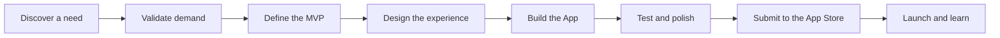
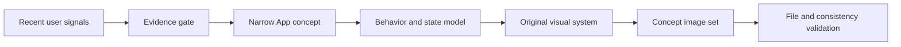

# Spark Skills

**Reusable Codex skills for building and shipping independent apps.**

[English](README.md) · [简体中文](README.zh-CN.md)

Spark Skills is a growing collection of Codex skills designed to help people become independent app developers. It breaks the path from discovering a real need to shipping an App Store product into focused workflows that can be used one stage at a time.

Each skill covers a practical part of the product lifecycle with clear triggers, decision criteria, concrete deliverables, and deterministic validation where possible. The long-term goal is a connected skill set that can guide a solo developer from opportunity discovery, product definition, and interface design through implementation, testing, App Store submission, launch, and iteration.

## 30-second start

Ask Codex to read the repository and install the skill that matches your current stage:

```text
Read https://github.com/China-Wesley/spark-skills and its skills.json. Recommend the most relevant available skill for my current App-development stage, explain what it will deliver, and install it for Codex.
```

To start directly with demand discovery and product definition:

```text
Install $daily-app-concept from https://github.com/China-Wesley/spark-skills and use it to find and validate one mobile App opportunity.
```

## What belongs here

- **Demand discovery** based on current user feedback, market signals, and existing alternatives.
- **Product validation and definition** for choosing a narrow user, problem, core action, and MVP.
- **UX, interface, and prototype workflows** that turn product behavior into a usable experience.
- **Implementation and testing workflows** for building a reliable App as a solo developer.
- **App Store release workflows** covering product pages, privacy, compliance, review, and launch readiness.
- **Post-launch workflows** for learning from usage, feedback, and business results.
- **Validation tools and focused references** that make every stage easier to review and repeat.

The goal is to turn independent development into a visible sequence of decisions and deliverables. Each skill should improve judgment at one stage and produce work that can be reviewed directly or handed to the next stage.

## The independent app path



The repository will grow along this path. The lifecycle table below separates what can be used today from stages still being developed.

| Stage | Core question | Skill | Status |
| --- | --- | --- | --- |
| Discover | Is there a real, specific user problem? | [`daily-app-concept`](skills/daily-app-concept/) | Available |
| Validate | Is the opportunity supported by users, market evidence, and technical reality? | [`daily-app-concept`](skills/daily-app-concept/) | Available |
| Define | What is the smallest useful product one person can build? | [`daily-app-concept`](skills/daily-app-concept/) | Available |
| Design | How should the core behavior, states, and visual language work? | [`daily-app-concept`](skills/daily-app-concept/) | Available |
| Build | How should the App be implemented without losing the MVP boundary? | — | Planned |
| Test | Is the product reliable, accessible, private, and ready to release? | — | Planned |
| Ship | Are metadata, screenshots, compliance, TestFlight, and review materials ready? | — | Planned |
| Learn | What should change after real usage and feedback? | — | Planned |

## Available skills

| Skill | Purpose | Main deliverables | Status |
| --- | --- | --- | --- |
| [`daily-app-concept`](skills/daily-app-concept/) | Find a current mobile product need, narrow it into a solo-developer-friendly App concept, derive an original visual system from product behavior, and create a coherent concept image set. | Research notes, product definition, visual system, manifest, and 5–7 App concept images. | Available |

The machine-readable catalog is [`skills.json`](skills.json). It records lifecycle coverage, discovery keywords, installation paths, deliverables, and availability so an Agent can select a skill without parsing the full README.

### `daily-app-concept`

This is the first workflow in Spark Skills and covers the opening stages of independent development: finding a need, validating the opportunity, defining a focused product, and making its core experience visible. Every concept must answer four basic questions:

1. Is there credible evidence that the problem exists?
2. Can one person build and test a narrow solution?
3. Does the visual language explain the product's core behavior?
4. Are the final images readable, consistent, original, and complete?

The skill researches recent user feedback and comparable products, scores candidate directions, defines a focused MVP, studies relevant design methods, and maps product behavior into interface components and states. It then creates a set of actual concept images and validates the output package.



Read the full instructions in [`skills/daily-app-concept/SKILL.md`](skills/daily-app-concept/SKILL.md).

## Working principles

Spark Skills follows a few recurring principles:

- **Evidence before commitment.** Separate direct user feedback, market proof, company or founder claims, and inference.
- **Narrow the product.** Define one target user, one trigger, one core action, and one immediate result before adding features.
- **Respect behavior cost.** Favor actions users already take, system-readable data, and fast feedback over workflows that demand constant manual maintenance.
- **Let behavior shape the visual system.** Colors, containers, type, motion, and components should communicate information, state, or action.
- **Learn from design work without copying it.** Extract general methods while preserving source links, authorship, and licensing boundaries.
- **Deliver artifacts.** Research lists and prompts support the work; reviewable files are the outcome.
- **Validate what can be validated.** Use deterministic scripts for structure, dimensions, duplicates, manifests, and other mechanical checks.

## Install

Clone the repository:

```bash
git clone https://github.com/China-Wesley/spark-skills.git
cd spark-skills
```

Install a skill by copying it or linking it into your Codex skills directory. A symbolic link is convenient when you plan to update the repository regularly:

```bash
mkdir -p "$HOME/.codex/skills"
ln -s "$(pwd)/skills/daily-app-concept" "$HOME/.codex/skills/daily-app-concept"
```

Pulling future repository updates will then update the linked skill:

```bash
git pull --ff-only
```

## Use

Invoke a skill explicitly by name:

```text
Use $daily-app-concept to research one current mobile need and produce a complete App concept with actual images.
```

Codex can also select an installed skill automatically when the request matches its description.

Before using a skill, read its `SKILL.md`. Some skills may route to additional files in `references/`, use helpers in `scripts/`, or include reusable materials in `assets/`.

## Agent discovery protocol

When an Agent is asked to find or install a Spark Skill:

1. Read [`skills.json`](skills.json) and match the request against `lifecycle_stages`, `keywords`, and `summary`.
2. Recommend only skills whose status is `available`. Explain the stage covered, expected deliverables, and important boundaries.
3. Read the selected `entrypoint` before starting work. Load files in `references/` only when the entrypoint routes to them.
4. Install the catalog's `install.source` directory under the Agent's skills directory using the skill `name`.
5. Verify that `SKILL.md` exists and its frontmatter name matches the catalog entry. Do not treat a copied folder as successfully installed until this check passes.

Repository maintainers should run the catalog validator after adding, moving, or renaming a skill:

```bash
python3 scripts/validate_catalog.py --json
```

## Repository structure

```text
spark-skills/
├── README.md
├── README.zh-CN.md
├── skills.json
├── LICENSE
├── scripts/
│   └── validate_catalog.py
└── skills/
    └── daily-app-concept/
        ├── SKILL.md
        ├── agents/
        │   └── openai.yaml
        ├── references/
        │   ├── deliverables.md
        │   ├── evidence-and-selection.md
        │   └── visual-system.md
        └── scripts/
            └── validate_output.py
```

Each skill keeps its main instructions in `SKILL.md` and adds supporting resources only when they improve the workflow:

- `agents/` contains UI-facing metadata and invocation settings.
- `references/` contains detailed guidance loaded only when relevant.
- `scripts/` contains repeatable or deterministic operations.
- `assets/` may contain templates or source materials intended for generated output.

## How new skills are designed

New skills are added when a workflow has been exercised enough to capture useful judgment and produce a reliable handoff to the next stage. Every addition should have:

- A precise name and description that make automatic discovery reliable.
- A clear lifecycle stage, trigger, scope boundary, input, output, and handoff.
- A concise `SKILL.md`, with conditional detail moved into `references/`.
- Scripts only where repeatability or deterministic validation adds real value.
- Concrete deliverables that can be inspected independently of the conversation.
- A matching entry in `skills.json` and a passing catalog validation result.

Build, test, App Store submission, and post-launch learning remain planned areas. The lifecycle table above is the source of truth for current coverage.

## Contributing and feedback

Suggestions, real usage reports, and focused improvements are welcome through GitHub Issues. When proposing a new skill, describe the stage of independent development it supports, the decisions it should improve, and what a reviewable result looks like.

## Inspiration

The repository navigation and catalog design were informed by [`alchaincyf/huashu-skills`](https://github.com/alchaincyf/huashu-skills), especially its human-readable routing, machine-readable skill index, and explicit installation protocol. Spark Skills applies those high-level patterns to an original independent-App lifecycle; no Skill text or implementation code from that repository is included here.

## License

This repository is available under the [MIT License](LICENSE).
