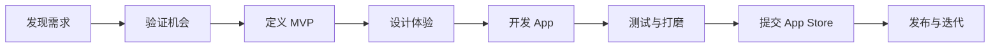
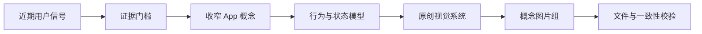

# Spark Skills

**帮助每个人用 Codex 完成从需求发现到 App 上架的独立开发。**

[English](README.md) · [简体中文](README.zh-CN.md)

Spark Skills 是一个帮助大家成为独立开发者的 Codex Skills 仓库。它把“发现真实需求，做出产品，再把 App 上架”这条复杂路径拆成可以逐步调用的工作流。

每个 Skill 负责产品生命周期中的一个具体阶段，写清何时触发、依据什么做判断、如何推进、需要交付哪些文件，以及哪些结果可以通过脚本校验。长期目标是形成一套相互衔接的 Skills，让一个人也能从机会发现、产品定义和界面设计，一直走到开发、测试、App Store 审核、发布和后续迭代。

## 这个仓库会收录什么

- **需求发现**：从近期用户反馈、市场信号和现有替代方案中识别值得解决的问题。
- **产品验证与定义**：确定窄目标用户、核心问题、关键动作和 MVP。
- **体验设计与原型**：把产品行为转化为清楚、可用的交互和界面。
- **开发与测试**：帮助个人开发者构建可靠的 App，并控制实现范围。
- **App Store 上架**：覆盖产品页、隐私、合规、审核和发布准备。
- **发布后迭代**：根据使用情况、反馈和商业结果持续判断下一步。
- **校验工具与参考资料**：让每个阶段都更容易检查、复用和交接。

这个仓库希望把独立开发变成一条看得见的决策和交付链路。每个 Skill 都应当改善其中一个阶段的判断，并产出可以直接检查或交给下一阶段继续使用的结果。

## 独立 App 开发路径



仓库会沿着这条路径持续补全。已有 Skills 表示现在可以直接使用的能力，后续规划则说明仍在建设的阶段。

## 已有 Skills

| Skill | 用途 | 主要交付物 | 状态 |
| --- | --- | --- | --- |
| [`daily-app-concept`](skills/daily-app-concept/) | 从近期真实反馈中发现一个移动产品需求，将其收窄成适合个人开发者验证的 App 概念，再从产品行为推导原创视觉系统并制作完整示意图。 | 调研记录、产品定义、视觉系统、清单文件和 5–7 张 App 概念图。 | 可用 |

### `daily-app-concept`

这是 Spark Skills 的第一个工作流，覆盖独立开发的起点：发现需求、验证机会、定义聚焦的产品，并把核心体验清楚地呈现出来。每个概念都必须回答四个基本问题：

1. 是否有可信证据说明这个问题真实存在？
2. 能否收窄成一个人可以开发和验证的方案？
3. 视觉语言能否解释产品最核心的行为？
4. 最终图片是否清楚、一致、原创并且完整？

这个 Skill 会调研近期用户反馈和可比产品，给候选方向评分，定义聚焦的 MVP，研究相关设计方法，再把产品行为映射为界面组件和状态。最后生成一套实际的概念图片，并校验输出目录。



完整说明见 [`skills/daily-app-concept/SKILL.md`](skills/daily-app-concept/SKILL.md)。

## 工作原则

Spark Skills 会长期坚持几条方法：

- **先看证据，再确定方向。** 分开记录普通用户反馈、市场证明、公司或开发者自述和仍属于推断的部分。
- **先收窄产品。** 增加功能以前，先定义一个目标用户、一个触发时刻、一个核心动作和一个立即可见的结果。
- **评估行为成本。** 优先承接用户已经发生的行为、系统可读取的数据和快速反馈，谨慎对待需要长期手工维护的流程。
- **从行为推导视觉。** 色彩、容器、字体、动效和组件都应承担信息、状态或操作作用。
- **研究设计方法，同时尊重原创。** 提炼通用方法，保留来源、作者和许可判断，不复制第三方独特表达。
- **交付实际成果。** 调研清单和提示词用于支持制作，可以直接检查的文件才是最终结果。
- **能自动检查的就自动检查。** 使用确定性脚本验证目录、尺寸、重复文件、清单和其他机械要求。

## 安装

克隆仓库：

```bash
git clone https://github.com/China-Wesley/spark-skills.git
cd spark-skills
```

把需要的 Skill 复制或链接到 Codex Skills 目录。如果准备长期更新这个仓库，使用软链接会更方便：

```bash
mkdir -p "$HOME/.codex/skills"
ln -s "$(pwd)/skills/daily-app-concept" "$HOME/.codex/skills/daily-app-concept"
```

以后拉取仓库更新，软链接安装的 Skill 也会同步更新：

```bash
git pull --ff-only
```

## 使用

可以在任务中明确调用 Skill：

```text
使用 $daily-app-concept 调研一个近期移动端需求，并交付包含实际图片的完整 App 概念。
```

安装后，当用户请求与 Skill 描述相符时，Codex 也可以自动选择它。

使用前先阅读对应的 `SKILL.md`。部分 Skill 会按需读取 `references/` 中的详细规则，调用 `scripts/` 中的工具，或使用 `assets/` 中的模板与素材。

## 仓库结构

```text
spark-skills/
├── README.md
├── README.zh-CN.md
├── LICENSE
└── skills/
    └── daily-app-concept/
        ├── SKILL.md
        ├── agents/
        │   └── openai.yaml
        ├── references/
        │   ├── deliverables.md
        │   ├── evidence-and-selection.md
        │   └── visual-system.md
        └── scripts/
            └── validate_output.py
```

每个 Skill 都把主要指令放在 `SKILL.md` 中，只在确实有用时增加辅助资源：

- `agents/`：面向界面的名称、描述和调用配置。
- `references/`：只在相关任务中加载的详细知识。
- `scripts/`：可重复运行或需要确定性结果的操作。
- `assets/`：用于生成结果的模板、图片或其他源文件。

## 后续规划

目标是形成一套真正覆盖独立 App 开发全流程的工具箱，计划逐步补全：

- **发现：** 从用户反馈、行为和市场证据中找到足够窄的问题。
- **验证：** 比较替代方案、验证假设、评估可行性并定义成功信号。
- **定义：** 写清产品承诺、用户流程、MVP 边界、收费假设和技术方案。
- **设计：** 完成信息架构、交互状态、视觉系统、原型和上架素材。
- **开发：** 建立项目、实现核心闭环、处理本地数据或服务端能力，并控制范围。
- **测试：** 检查功能、可访问性、性能、边界情况、隐私和发布质量。
- **上架：** 准备元数据、截图、隐私披露、合规材料、TestFlight 和 App Store 提交。
- **迭代：** 收集有效反馈与指标，决定继续优化、调整定位或停止投入。

只有当一套流程经过足够实践，能够沉淀出可靠判断并顺利交接给下一阶段时，才会整理成新的 Skill。

## 反馈与共建

欢迎通过 GitHub Issues 提交建议、真实使用反馈和聚焦的改进。如果希望增加新的 Skill，请尽量说明它服务于独立开发的哪个阶段、需要改善哪些判断，以及怎样的结果才算可检查、可交付。

## 许可协议

本仓库使用 [MIT License](LICENSE)。
